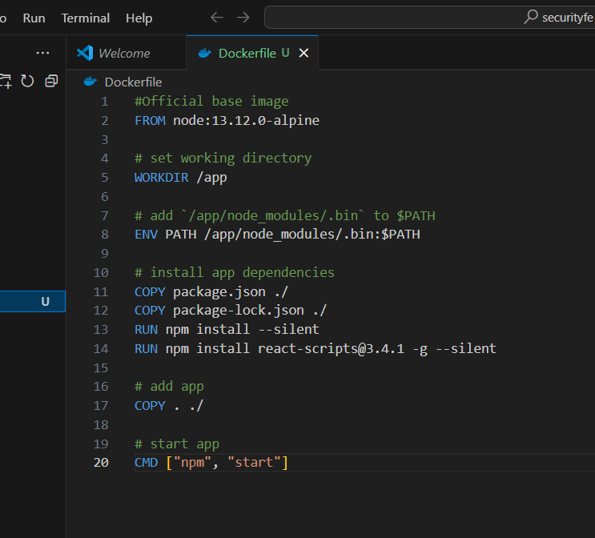
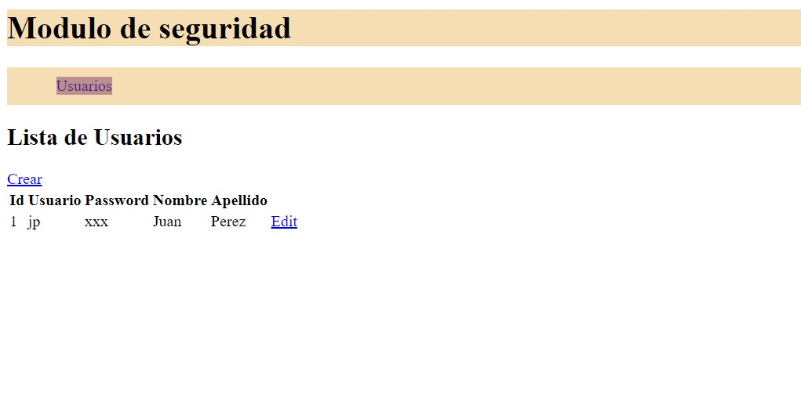

# Práctica: Despliegue de una Aplicación Frontend con Docker

## 1. Título

**Despliegue de una Aplicación Frontend con Docker**

---

## 2. Tiempo de duración

**60 minutos**

---

## 3. Fundamentos

El despliegue de aplicaciones frontend con Docker permite garantizar un entorno uniforme e independiente del sistema operativo. Esto es especialmente útil para aplicaciones desarrolladas con frameworks como React, que requieren un servidor de desarrollo o producción y ciertas dependencias específicas.

### **Conceptos clave**

1. **Node.js**: Es un entorno de ejecución de JavaScript que permite desarrollar aplicaciones de servidor. En esta práctica, usamos Node.js como base para construir y ejecutar la aplicación React.

2. **Dockerfile**: Es un archivo que define el conjunto de instrucciones para crear una imagen de Docker. Incluye comandos para configurar el entorno y ejecutar la aplicación.

3. **Red de contenedores**: Docker permite conectar múltiples contenedores dentro de una red virtual. En esta práctica, conectamos el frontend al backend para que ambos servicios interactúen.

### **Proceso general**

La aplicación frontend se desarrolla con React y se empaqueta en una imagen de Docker usando un `Dockerfile`. Esta imagen se utiliza para crear un contenedor que sirve la aplicación en el puerto 3000. La red de contenedores permite que el frontend consuma datos del backend desplegado previamente.

## 4. Conocimientos previos

Para realizar esta práctica, se requieren conocimientos sobre:
- Conceptos básicos de Docker y creación de imágenes.
- Familiaridad con React.
- Comandos básicos de terminal.
- Comprensión de redes de contenedores.

---

## 5. Objetivos a alcanzar

- Crear y ejecutar un contenedor para una aplicación frontend desarrollada en React.
- Configurar una red de contenedores para la comunicación entre el frontend y el backend.
- Validar el despliegue accediendo a la interfaz web en un navegador.

---

## 6. Equipo necesario

- Computadora con sistema operativo Windows, Linux o macOS.
- Docker Desktop instalado (versión 20.x o superior).
- Node.js y npm.
- Repositorio de la aplicación React.

---

## 7. Material de apoyo

- [Documentación oficial de Docker](https://docs.docker.com/).
- [Documentación de React](https://reactjs.org/).
- [Guía de asignatura].
- [Docker Compose Cheatsheet](https://devhints.io/docker-compose).

---

## 8. Procedimiento

### **Paso 1: Clonar el repositorio del proyecto React**

Ejecuta el siguiente comando en la terminal para clonar el repositorio:

git clone https://github.com/maguaman2/securityfe

### **Paso 2: Crear el archivo Dockerfile**
En la carpeta raíz del proyecto, crea un archivo llamado Dockerfile con el siguiente contenido:

### **Paso 3: Crear la imagen Docker**
Construye la imagen Docker con el siguiente comando:

docker build -t myappfe:latest .

### **Paso 4: Creamos una red de contenedores**
Creamos una red de contenedores para permitir la comunicación entre el frontend y el backend:

docker network create red_de_los_contenedores

### **Paso 5: Crear y ejecutar el contenedor**
Crea un contenedor basado en la imagen recién creada y expone el puerto 3000:

docker run -d --network red_de_los_contenedores -p 3000:3000 myappfe

###Paso 6: **Validar el despliegue**
Abre tu navegador y accede a http://localhost:3000. Deberías ver la lista de usuarios obtenida desde el backend.

## 9. Resultados esperados
La aplicación React debe estar disponible en el navegador en el puerto 3000, y debe consumir datos del backend en el puerto 8081, mostrando una lista de usuarios en pantalla.

